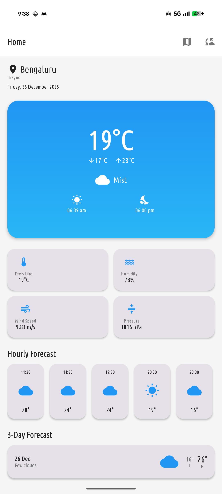
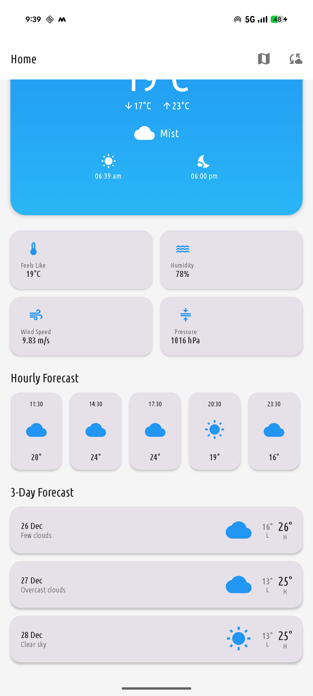
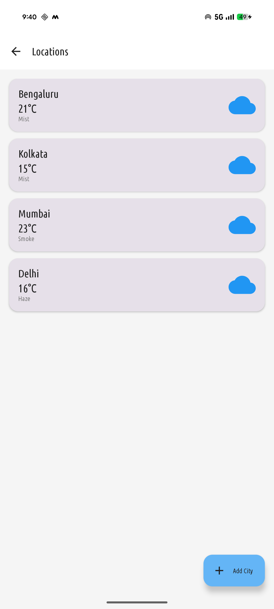

# 🌤️ Weather Forecast App

A modern Android weather application built with **Jetpack Compose**, following **Clean Architecture** principles and **MVVM** pattern. Get real-time weather updates, 3-day forecasts, and manage multiple cities with offline support.


## 📱 Screenshots

<!-- Add your app screenshots here -->
| Home Screen                          | Forecast                                       | Locations                                      |
|--------------------------------------|------------------------------------------------|------------------------------------------------|
|  |   |  |

## ✨ Features

### Core Features
- 🌡️ **Real-time Weather Data** - Get current weather conditions from OpenWeatherMap API
- 📅 **3-Day Forecast** - Hourly and daily weather predictions
- 📍 **GPS Location** - Automatic location detection on first launch
- 🏙️ **Multiple Cities** - Track weather for multiple locations
- 💾 **Offline Support** - Access cached weather data without internet
- 🔄 **Pull to Refresh** - Update weather data manually
- 🌙 **Beautiful UI** - Modern Material Design 3 interface

### Technical Features
- 🏗️ **Clean Architecture** - Separation of concerns with Data, Domain, and Presentation layers
- 🎯 **MVVM Pattern** - ViewModel-driven UI with reactive state management
- 💉 **Hilt Dependency Injection** - Efficient dependency management
- 🗄️ **Room Database** - Local caching with 30-minute validity
- 🌐 **Retrofit** - Type-safe HTTP client for API calls
- ⚡ **Kotlin Coroutines** - Asynchronous programming
- 🔄 **StateFlow** - Reactive UI updates
- 🧭 **Navigation Compose** - Type-safe navigation

## 🛠️ Tech Stack

| Category | Technology |
|----------|------------|
| **Language** | Kotlin |
| **UI Framework** | Jetpack Compose |
| **Architecture** | Clean Architecture + MVVM |
| **Dependency Injection** | Hilt |
| **Local Database** | Room |
| **Networking** | Retrofit + OkHttp |
| **Async** | Coroutines + Flow |
| **Location** | Google Play Services Location |
| **Design** | Material Design 3 |

## 🏗️ Project Architecture
```
app/
├── data/
│   ├── local/
│   │   ├── dao/              # Room DAOs
│   │   ├── database/         # Room Database
│   │   └── entity/           # Room Entities
│   ├── remote/
│   │   ├── api/              # Retrofit API Service
│   │   └── dto/              # Data Transfer Objects
│   └── repository/           # Repository Implementation
├── di/
│   ├── AppModule.kt          # App-level dependencies
│   ├── DatabaseModule.kt     # Room dependencies
│   └── NetworkModule.kt      # Retrofit dependencies
├── domain/
│   ├── model/                # Domain Models
│   ├── repository/           # Repository Interface
│   └── usecase/              # Business Logic Use Cases
├── presentation/
│   ├── splash/               # Splash Screen
│   ├── home/                 # Home Screen with Forecast
│   ├── locations/            # Manage Cities
│   ├── navigation/           # Navigation Graph
│   └── theme/                # App Theme & Typography
└── util/                     # Utility Classes
```

### Architecture Layers
```
┌─────────────────────────────────────┐
│     Presentation Layer              │
│  (Compose UI + ViewModels)          │
├─────────────────────────────────────┤
│     Domain Layer                    │
│  (Use Cases + Models)               │
├─────────────────────────────────────┤
│     Data Layer                      │
│  (Room + Retrofit + Repository)     │
└─────────────────────────────────────┘
```

## 🚀 Getting Started

### Prerequisites

- Android Studio Hedgehog (2023.1.1) or later
- JDK 17 or later
- Android SDK 24 or higher
- OpenWeatherMap API Key (free)

### Installation

1. **Clone the repository**
```bash
   git clone https://github.com/yourusername/weather-forecast-app.git
   cd weather-forecast-app
```

2. **Get your OpenWeatherMap API Key**
    - Visit [OpenWeatherMap](https://openweathermap.org/api)
    - Sign up for a free account
    - Generate an API key

3. **Add your API Key**

   Open `app/build.gradle.kts` and replace `YOUR_API_KEY_HERE`:
```kotlin
   buildConfigField("String", "API_KEY", "\"your_actual_api_key_here\"")
```

4. **Sync Gradle**
```bash
   ./gradlew build
```

5. **Run the app**
    - Connect your Android device or start an emulator
    - Click Run in Android Studio or use:
```bash
   ./gradlew installDebug
```

## 📋 Configuration

### API Configuration

The app uses OpenWeatherMap API with the following settings:
```kotlin
BASE_URL = "https://api.openweathermap.org/data/2.5/"
CACHE_DURATION_MINUTES = 30
DEFAULT_CITY = "Mumbai"
UNITS = "metric" // Celsius
```

### Permissions

Required permissions in `AndroidManifest.xml`:
```xml
<uses-permission android:name="android.permission.INTERNET" />
<uses-permission android:name="android.permission.ACCESS_NETWORK_STATE" />
<uses-permission android:name="android.permission.ACCESS_FINE_LOCATION" />
<uses-permission android:name="android.permission.ACCESS_COARSE_LOCATION" />
```

## 📱 App Flow

### First Launch
1. **Splash Screen** - Shows app branding with animation
2. **Location Permission** - Requests GPS permission
3. **Auto-detect Location** - Gets city from GPS coordinates
4. **Load Weather** - Fetches current weather and forecast
5. **Cache Data** - Saves data locally for offline access

### Normal Usage
1. View current weather on home screen
2. Scroll to see hourly and daily forecasts
3. Pull down to refresh data
4. Tap "Locations" to manage cities
5. Long-press on a city to delete it

## 🎨 UI Screens

### 1. Splash Screen
- Animated weather icon
- App logo and name
- Smooth transition to home

### 2. Home Screen
- **Current Weather Card**
    - Temperature (current, min, max)
    - Weather condition with icon
    - Sunrise and sunset times
- **Weather Details Grid**
    - Feels like temperature
    - Humidity percentage
    - Wind speed
    - Atmospheric pressure
- **Hourly Forecast**
    - Next 24 hours (8 items)
    - Temperature and condition
- **3-Day Forecast**
    - Daily high and low
    - Weather conditions

### 3. Locations Screen
- List of saved cities
- Add new cities with bottom sheet
- Long-press to delete
- Tap to switch city

## 🗂️ Key Components

### Data Layer

**Room Database**
```kotlin
@Database(entities = [WeatherEntity, ForecastEntity, CityEntity])
abstract class WeatherDatabase : RoomDatabase()
```

**API Service**
```kotlin
interface WeatherApiService {
    @GET("weather")
    suspend fun getCurrentWeather(...)
    
    @GET("forecast")
    suspend fun getForecast(...)
}
```

### Domain Layer

**Use Cases**
- `GetCurrentWeatherUseCase` - Fetch current weather
- `GetForecastUseCase` - Fetch forecast data
- `AddCityUseCase` - Add city to favorites
- `RemoveCityUseCase` - Remove city from favorites
- `GetSavedCitiesUseCase` - Get all saved cities

### Presentation Layer

**ViewModels**
```kotlin
@HiltViewModel
class HomeViewModel @Inject constructor(
    private val getCurrentWeatherUseCase: GetCurrentWeatherUseCase,
    private val getForecastUseCase: GetForecastUseCase,
    private val locationManager: LocationManager,
    private val preferencesManager: PreferencesManager
) : ViewModel()
```

## 🔧 Customization

### Change Default City
```kotlin
// util/Constants.kt
const val DEFAULT_CITY = "YourCity"
```

### Change Cache Duration
```kotlin
// util/Constants.kt
const val CACHE_DURATION_MINUTES = 60 // 1 hour
```

### Change Theme Colors
```kotlin
// presentation/theme/Color.kt
val PrimaryBlue = Color(0xFF2196F3)
val PrimaryDark = Color(0xFF1976D2)
```

## 🐛 Troubleshooting

### Common Issues

**1. Build Error: Unresolved reference 'BuildConfig'**
```kotlin
// Enable BuildConfig in app/build.gradle.kts
buildFeatures {
    buildConfig = true
}
```

**2. API Key Not Working**
- Wait 10-15 minutes for new API keys to activate
- Verify the key is correctly formatted with quotes
- Check OpenWeatherMap account status

**3. Location Not Working**
- Ensure location permissions are granted
- Check device location settings are enabled
- Verify Google Play Services is installed

**4. Network Error**
- Check internet connection
- Verify API key is valid
- Check firewall settings

## 📊 API Usage

### OpenWeatherMap Free Tier
- **1,000 calls/day**
- **60 calls/minute**
- 5-day / 3-hour forecast

### App API Optimization
- 30-minute cache duration
- Offline-first approach
- Single API call per refresh
- Efficient data usage

## 🧪 Testing

### Manual Testing Checklist
- [ ] Splash screen animation
- [ ] Location permission dialog
- [ ] GPS location detection
- [ ] Weather data loading
- [ ] Forecast display
- [ ] Pull to refresh
- [ ] Add city
- [ ] Remove city
- [ ] City selection
- [ ] Offline mode
- [ ] Data caching
- [ ] Error handling

### Test Offline Mode
1. Load weather data
2. Enable Airplane Mode
3. Close and reopen app
4. Verify cached data is displayed
5. Check offline indicator appears


## 👨‍💻 Author

**Your Name**
- GitHub: [@Hemanth U M](https://github.com/Git-Hem)
- LinkedIn: [Hemanth U M](www.linkedin.com/in/hemanth-u-m-577683117)
- Email: hemanthum12@example.com / hemanth123453@gmail.com


